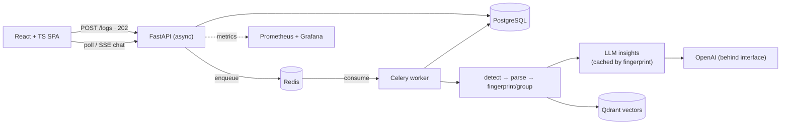

<div align="center">

# 🔍 AI Log Analyzer

**Turn thousands of raw log lines into a root-cause diagnosis in seconds.**

An AI platform that ingests application & infrastructure logs, groups and classifies errors,
identifies probable root causes with confidence scores, explains failures in plain language,
suggests *safe* remediation commands, finds similar past incidents, chats over your logs, and
runs a multi-agent investigation of complex incidents.


</div>

---

<!--
  📸 ADD A SCREENSHOT HERE (biggest single win for first impressions):
  1. Run `docker compose up --build`, open http://localhost:3000
  2. Register, paste the sample log below, screenshot the analysis dashboard + chat
  3. Save it to docs/assets/dashboard.png and uncomment the line below.
-->
<!--  -->

## ✨ Highlights — the hard problems this solves

- **Deduplicate before the LLM.** Errors are fingerprinted into groups *before* any AI call, so
  212 identical timeouts cost **one** analysis, not 212 — the main cost & quality lever.
- **Prompt-injection safe by construction.** Log content is attacker-controlled; it's fenced as
  data, and remediation commands are rendered from an **allow-listed template catalog** (read-only,
  regex-validated params) — a model *cannot* emit `rm -rf /` because no template produces it.
- **Grounded chat that refuses instead of hallucinating.** When retrieval is weak, the chat says
  *"I don't see that in this log"* — enforced **in code, without an LLM call** — and cites exact
  line ranges when it does answer.
- **Multi-agent investigation with a verifier that can say no.** Planner → Investigator → Verifier,
  under hard step/time budgets, with a fully persisted, inspectable trace; it refuses to claim
  causation without temporal evidence.
- **Fully testable offline.** Every external dependency (LLM, queue, embeddings, vector store, DB)
  sits behind an interface with a fake — the **99-test suite runs with zero API calls or infra.**

## 🎬 What it does

Paste or upload logs → the platform detects the format, parses & groups errors, then:

| Capability | |
|---|---|
| **Error classification & severity** | typed categories, AI-refined severity |
| **Root-cause analysis** | probable cause, possible reasons, confidence score |
| **Plain-language explanation** | beginner-friendly, no jargon |
| **Safe remediation** | allow-listed `kubectl` / `systemctl` / AWS diagnostics only |
| **Similar-incident search** | "have we seen this before?" via vector similarity |
| **Chat with your logs** | streamed answers grounded in cited log lines (RAG) |
| **Incident reports** | postmortem-ready markdown, downloadable |
| **Incident timeline** | causal ordering, first-failure detection |
| **Multi-agent investigation** | planner/investigator/verifier with an auditable trace |

## 🏗️ Architecture

Modular monolith (FastAPI) deployed as two processes from one image — an API server and a Celery
worker — with strict clean-architecture layers. Slow AI work runs off-request behind a
`202 Accepted` + poll pattern, so the API stays fast.



**The pattern that makes it all testable** — every dependency has a production impl and a fake:

| Interface | Production | Test / dev |
|---|---|---|
| `LLMProvider` | OpenAI (httpx, structured output) | deterministic mock |
| `TaskQueue` | Celery + Redis | in-process inline runner |
| `EmbeddingProvider` | sentence-transformers | dependency-free hashing |
| `VectorStore` | Qdrant (REST) | in-memory |
| Database | PostgreSQL (async) | SQLite |

Full write-up: **[System design](docs/portfolio/system-design.md)** · **[Architecture](docs/planning/02-architecture.md)** · **[ADRs](docs/adr/)**

## 🧰 Tech stack

| Area | Tech |
|---|---|
| Backend | Python 3.12, FastAPI, SQLAlchemy 2.0 (async), Alembic, Celery |
| Data | PostgreSQL, Redis, Qdrant |
| AI | OpenAI (behind a provider interface), sentence-transformers, RAG, multi-agent |
| Frontend | React, TypeScript, Tailwind CSS (SSE streaming, typed API client) |
| Infra | Docker, docker-compose, Kubernetes (Deployment/Service/Ingress/HPA), Prometheus/Grafana |
| Quality | pytest (99 tests), ruff, black, mypy, pre-commit, GitHub Actions CI |

## 🚀 Quick start

**Docker only** (needs just [Docker Desktop](https://www.docker.com/products/docker-desktop/)):

```bash
cp backend/.env.example backend/.env       # set POSTGRES_PASSWORD (+ APP_OPENAI_API_KEY for live AI)
docker compose up --build
docker compose exec api alembic upgrade head
```

- **App:** http://localhost:3000  ·  **API docs:** http://localhost:8000/docs  ·  **Grafana:** http://localhost:3001

Try it with this sample (paste it in the app):

```
2026-07-15 10:12:14 ERROR Database connection timeout
Connection refused to PostgreSQL
```

> No OpenAI key? Everything works except AI insights & chat — a built-in mock provider powers a full
> offline demo. See the **[user guide](docs/guides/user-guide.md)**.

**Local dev** (Python 3.12+, Node 20+): `bash scripts/setup.sh` (or `scripts\setup-windows.ps1`) —
installs deps and runs the test suite.

## 🧪 Tests & quality

```bash
cd backend && pytest          # 99 tests, offline, ~30s
ruff check . && mypy app      # lint + types
cd ../frontend && npm run typecheck && npm run build
```

CI (GitHub Actions) gates every PR on backend lint/types/tests (70% coverage floor) and frontend
typecheck + build.

## 📚 Documentation

- **Portfolio:** [System design](docs/portfolio/system-design.md) · [Resume bullets](docs/portfolio/resume-bullets.md) · [Interview Q&A](docs/portfolio/interview-qa.md) · [Related work](docs/portfolio/related-work.md)
- **Build story:** [Progress tracker](progress.md) · [Module guides 01–10](docs/modules/) · [Changelog](CHANGELOG.md)
- **Guides:** [Deployment](docs/guides/deployment-guide.md) · [Developer](docs/guides/developer-guide.md) · [User](docs/guides/user-guide.md)
- **Decisions:** [ADRs](docs/adr/) · [Requirements](docs/planning/01-requirements.md) · [Risk register](docs/planning/04-risk-register.md) · [Backlog](docs/planning/05-backlog.md)

## 📄 License

[MIT](LICENSE)

<div align="center"><sub>Built module-by-module with clean architecture, ADRs, and a test-first workflow — the build log lives in <a href="progress.md">progress.md</a>.</sub></div>
