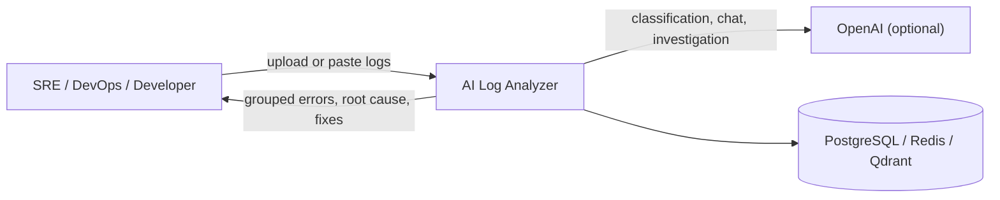

# 01 — Project Overview

## Overview

AI Log Analyzer is a platform that ingests application and infrastructure logs and turns them into
actionable diagnosis: it groups and classifies errors, identifies probable root causes with a
confidence score, explains failures in plain language, suggests **safe** remediation commands,
finds similar past incidents, answers questions about a log via chat, and runs a multi-agent
investigation of complex incidents.

## Business problem

During an incident, mean-time-to-resolution is dominated by *diagnosis*, not repair. Engineers face
thousands of unfamiliar log lines under time pressure. This platform compresses that diagnostic
phase by doing the pattern-recognition, root-cause reasoning, and runbook lookup automatically —
targeting SREs, DevOps engineers, and developers. See
[`docs/planning/01-requirements.md`](planning/01-requirements.md) for personas and user stories.

## Purpose

Reduce diagnosis time from hours to minutes by combining **deterministic log processing**
(parsing, deduplication, grouping) with **AI reasoning** (classification, root cause, chat,
investigation), while never sacrificing safety (commands are suggested, never executed; log content
is treated as untrusted input).

## Scope

**In scope (implemented):** file/paste ingestion; format detection & parsing; error
fingerprinting/grouping; AI classification, root cause, and explanation; similar-incident search;
chat-with-logs (RAG); incident reports; remediation command suggestions; incident timeline;
multi-agent investigation; JWT auth; audit logging; Prometheus metrics; Docker & Kubernetes
deployment.

**Out of scope (Inference — not implemented):** live streaming from K8s pods / Docker / tailing;
multi-tenant organizations/RBAC beyond user-owns-data; automatic command execution; PDF report
export; mobile UI. See [`docs/planning/05-backlog.md`](planning/05-backlog.md).

## Features (implemented)

| Feature | Entry point (code) |
|---|---|
| Upload / paste logs | `backend/app/api/v1/logs.py` |
| Format detection & parsing | `backend/app/parsing/` |
| Error fingerprinting & grouping | `backend/app/parsing/fingerprint.py`, `backend/app/services/pipeline.py` |
| AI classification / root cause / explanation | `backend/app/ai/pipelines/analyze.py`, `backend/app/ai/prompts/analysis.py` |
| Similar-incident search | `backend/app/services/similarity.py` |
| Chat with logs (RAG, SSE) | `backend/app/api/v1/chat.py`, `backend/app/ai/rag/` |
| Incident reports | `backend/app/services/report.py` |
| Remediation commands | `backend/app/ai/commands/` |
| Timeline & multi-agent investigation | `backend/app/services/timeline.py`, `backend/app/ai/agents/` |
| Auth, audit, rate limiting | `backend/app/services/auth.py`, `backend/app/core/` |
| Metrics | `backend/app/core/metrics.py` |

## High-level context diagram

## Status

Feature-complete: all 10 AI phases from the brief delivered; 99 backend tests passing; frontend
typechecks and builds. See [`progress.md`](../progress.md) for the full milestone log and
[`CHANGELOG.md`](../CHANGELOG.md) for release history.

## Cross-references

- Architecture → [02](02_High_Level_Architecture.md)
- What it does, step by step → [15 User Guide](15_User_Guide.md)
- Why decisions were made → [`docs/adr/`](adr/)

## Interview notes

- **One-liner:** "An LLM-assisted incident-diagnosis platform that deduplicates errors before the
  model sees them, grounds every AI answer in evidence, and never executes anything."
- **Why it matters:** it demonstrates AI integrated into a real engineering workflow with safety,
  cost, and testability treated as first-class concerns — not a chatbot wrapper.
