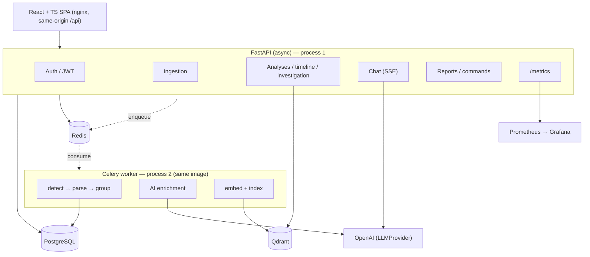
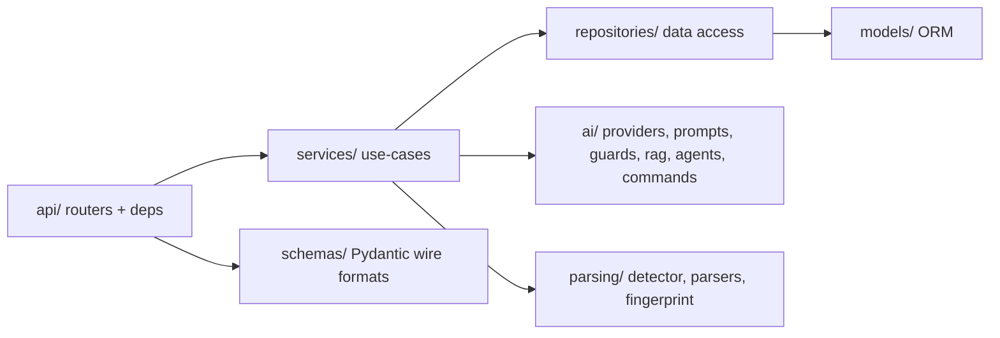

# 02 — High-Level Architecture

## Overview

The system is a **modular monolith** built with FastAPI, deployed as two processes from one image
(API server + Celery worker), backed by PostgreSQL, Redis, and Qdrant, with a React SPA served by
nginx. Rationale and alternatives are recorded in [ADR-001](adr/001-modular-monolith.md).

## Architecture diagram

Source: [`diagrams/architecture.mmd`](diagrams/architecture.mmd).

## Component responsibilities

| Component | Responsibility | Code |
|---|---|---|
| API (FastAPI) | HTTP, auth, validation, orchestration, SSE, metrics | `backend/app/api/`, `backend/app/main.py` |
| Worker (Celery) | Async parse → group → AI → index | `backend/app/workers/`, `backend/app/services/pipeline.py` |
| PostgreSQL | Relational store (users → logs → analyses → groups → insights, chat, reports, investigations) | `backend/app/models/` |
| Redis | Celery broker + rate-limit backing (Inference: rate limiter is in-memory today, Redis planned) | `backend/app/workers/celery_app.py` |
| Qdrant | Vector similarity search with per-user payload filtering | `backend/app/ai/vectorstore/qdrant.py` |
| OpenAI | LLM inference behind `LLMProvider` interface | `backend/app/ai/providers/openai.py` |
| Frontend | SPA; same-origin `/api` via nginx | `frontend/` |

## Clean-architecture layers

Dependencies point inward; each layer knows only the layer beneath it.

Detailed layer rules: [03 Low-Level Design](03_Low_Level_Design.md) and
[`docs/planning/02-architecture.md`](planning/02-architecture.md).

## The interface/seam pattern (key design decision)

Every external dependency is an interface with a production impl and a test fake. This is the single
most important structural choice — it makes the whole suite run offline.

| Interface | Production | Test/dev | Code |
|---|---|---|---|
| `LLMProvider` | OpenAI | Mock | `backend/app/ai/providers/` |
| `TaskQueue` | Celery | Inline | `backend/app/core/queue.py` |
| `EmbeddingProvider` | sentence-transformers | Hashing | `backend/app/ai/embeddings/` |
| `VectorStore` | Qdrant | In-memory | `backend/app/ai/vectorstore/` |
| Database | PostgreSQL | SQLite | `backend/app/core/db.py`, `backend/tests/conftest.py` |

## Configuration

Centralized, 12-factor, via `pydantic-settings` with prefix `APP_`
(`backend/app/core/config.py`). Full variable table: [08 DevOps & Deployment](08_DevOps_Deployment.md).
Empty `APP_OPENAI_API_KEY` disables AI; empty `APP_QDRANT_URL` disables similarity — both degrade
gracefully.

## Security considerations

Same-origin design (nginx reverse-proxies `/api`) removes CORS entirely; JWT auth; log content
treated as untrusted. Details: [09 Security](09_Security.md).

## Performance & scaling considerations

Stateless API (horizontal scale), async I/O throughout, `202 Accepted` for slow work, connection
pooling, per-fingerprint AI caching. Details: [10 Performance & Scaling](10_Performance_and_Scaling.md).

## Best practices demonstrated

Clean architecture, dependency injection, repository pattern, interface seams, graceful degradation,
structured logging, fail-fast config.

## Common pitfalls

- Treating the worker as a different codebase — it is the **same image**, different command.
- Adding a DB check to liveness (must be readiness) — see [09](09_Security.md)/[12](12_Operations_Runbook.md).

## Interview notes

- **Why modular monolith?** Microservices solve org-scaling we don't have; module seams *are* the
  future service boundaries ([ADR-001](adr/001-modular-monolith.md)).
- **Follow-up — when would you split?** When worker load needs an independent release cadence, or
  multiple teams contend on the codebase; extract `workers/` + `ai/` first.
