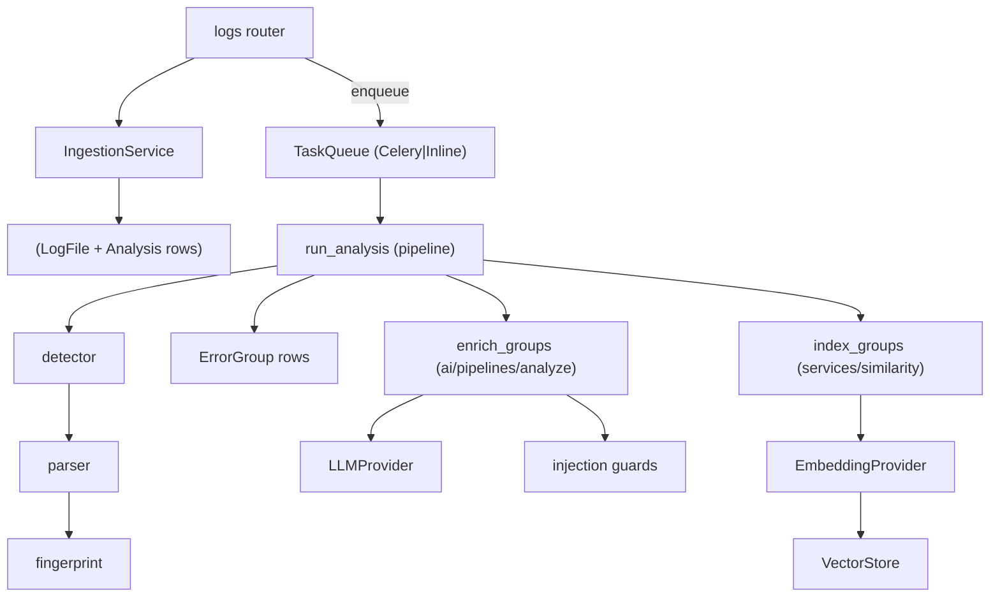

# 03 — Low-Level Design

## Overview

This document describes the internal structure of the backend: the layer boundaries, the key
modules, and the design patterns used. It is the detailed companion to
[02 High-Level Architecture](02_High_Level_Architecture.md).

## Backend package layout

```
backend/app/
├── main.py                 # app factory + lifespan (creates DB pool, embedder, providers, queue)
├── api/
│   ├── deps.py             # DI type-aliases: SettingsDep, DBDep, CurrentUser
│   └── v1/                 # routers: health, auth, users, logs, analyses, chat, reports, investigations
├── core/                   # config, db, security, exceptions, ratelimit, queue, metrics, logging
├── models/                 # SQLAlchemy ORM (11 tables)
├── schemas/                # Pydantic request/response
├── repositories/           # data access (user, audit)
├── services/               # use-cases (auth, ingestion, pipeline, similarity, report, timeline, investigation)
├── parsing/                # detector, parsers/, fingerprint
├── ai/                     # providers/, embeddings/, vectorstore/, prompts/, guards/, rag/, agents/, commands/, pipelines/
└── workers/                # celery_app, tasks
```

## Layer rules (dependency direction)

| Layer | May import | Must NOT import |
|---|---|---|
| `api/` | schemas, services, core | ORM models directly, LLM SDKs |
| `services/` | repositories, ai, parsing, core, models | FastAPI request objects |
| `repositories/` | models, SQLAlchemy | business rules, HTTP |
| `ai/`, `parsing/` | core, their own subpackages | HTTP, DB sessions (they receive a session) |
| `models/` | base | everything else |

## Key design patterns

| Pattern | Where | Why |
|---|---|---|
| App factory + lifespan | `main.py:create_app`, `lifespan` | testable, no import-time side effects |
| Dependency injection | `api/deps.py` (`Annotated[..., Depends(...)]`) | swap deps in tests via `app.dependency_overrides` |
| Repository | `repositories/user.py`, `audit.py` | isolate SQL from business logic |
| Strategy / interface seam | `ai/providers`, `core/queue`, `ai/embeddings`, `ai/vectorstore` | swap prod/fake impls |
| Registry | `parsing/parsers/__init__.py` (`REGISTRY`) | open-closed: add a parser without editing a ladder |
| Template method (agents) | `ai/agents/*` implement `Agent` protocol | uniform planner/investigator/verifier steps |

## Session & transaction model

`get_db` (`core/db.py`) yields one `AsyncSession` per request and **commits on success /
rolls back on error in one place** — services and repositories never call `commit()` themselves, so
a request is transactional. The worker (`workers/tasks.py`) creates its own engine/session per task
because there is no request to attach to.

## Component diagram — analysis path



## Error handling

Domain exceptions (`core/exceptions.py`: `DomainError`, `NotFoundError`, `ConflictError`,
`AuthenticationError`, `RateLimitError`, plus `FileTooLargeError`, `AIUnavailableError`) are raised
by services and mapped by a single handler to a consistent JSON body
`{"error": {"code", "message"}}`. Unexpected exceptions log a traceback and return a generic 500
(no internals leaked). See [09 Security](09_Security.md).

## Configuration surface

All tunables live in `core/config.py` (`Settings`). Notable: `access_token_expire_minutes` (15),
`refresh_token_expire_days` (7), `ai_max_groups_per_analysis` (10), `max_upload_bytes` (50MB),
`max_paste_bytes` (1MB), `embedding_backend` (`hashing`|`sentence-transformers`). Full table in
[08](08_DevOps_Deployment.md).

## Code references

- App factory: `backend/app/main.py`
- DI: `backend/app/api/deps.py`
- Pipeline: `backend/app/services/pipeline.py`
- Exceptions: `backend/app/core/exceptions.py`

## Best practices / common pitfalls

- **Do** raise domain exceptions in services; let the handler translate to HTTP.
- **Don't** call `session.commit()` in a service on the request path — the dependency owns it.
- **Do** add new formats via the parser registry; **don't** grow an if/else ladder.

## Interview notes

- **Why an app factory?** Per-test app instances, no import-order bugs, one visible config point.
- **How is AI mockable?** Providers are interfaces; tests inject a `MockLLMProvider` via the queue
  and `app.state`. Follow-up: "show me a test" → `backend/tests/integration/test_ai_flow.py`.
