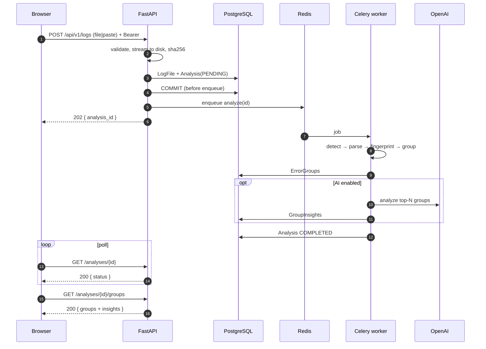
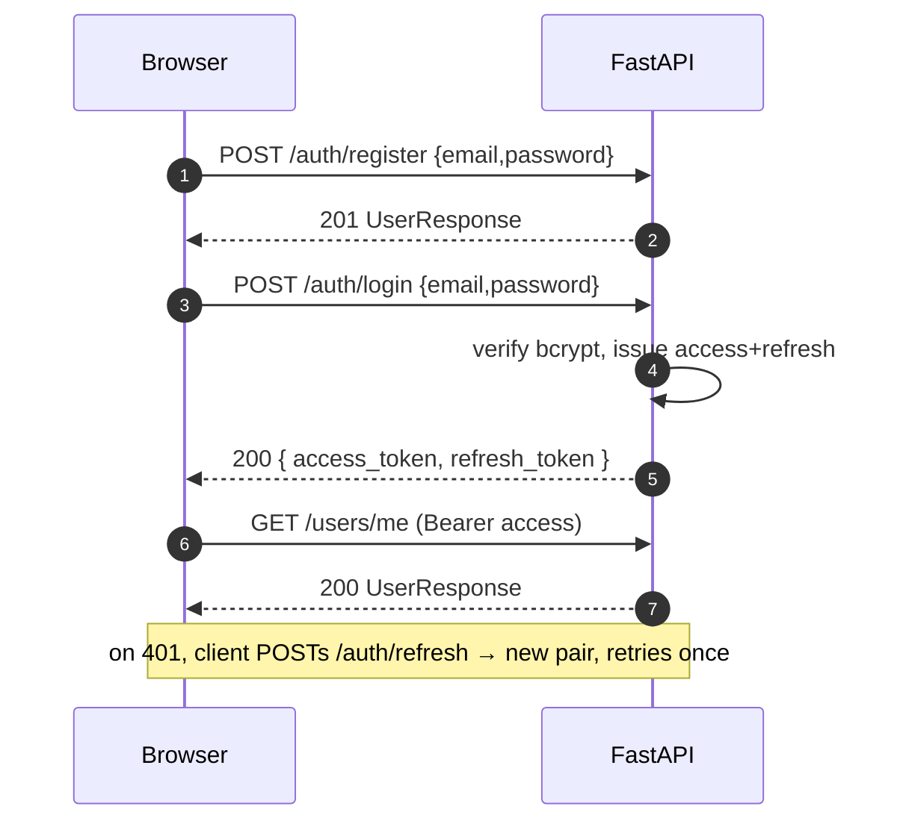
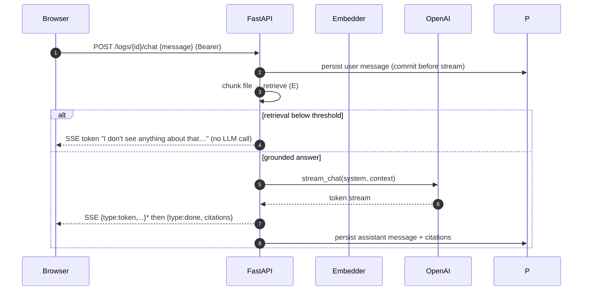

# 04 — Request Flow

## Overview

This document traces the important end-to-end flows through the system. The canonical flow is
**upload → async analysis → poll** (the `202 Accepted` pattern from
[ADR-002](adr/002-celery-for-ai-jobs.md)).

## Flow 1 — Ingestion & analysis (async)

Source: [`diagrams/sequence.mmd`](diagrams/sequence.mmd).

**Critical detail:** the API **commits before enqueue**. Enqueuing inside an uncommitted
transaction lets the worker (separate session) race ahead and find no rows — a real bug caught by
tests. See `backend/app/api/v1/logs.py:_accept`.

## Flow 2 — Authentication

Client-side refresh/retry: `frontend/src/api/client.ts`. Server: `backend/app/services/auth.py`.

## Flow 3 — Chat with logs (SSE streaming)

Grounding/refusal logic: `backend/app/ai/pipelines/chat.py`. Endpoint: `backend/app/api/v1/chat.py`.

## Flow 4 — Multi-agent investigation

`POST /analyses/{id}/investigate` → build evidence from timeline → run planner → investigator →
verifier under budget → persist steps → return conclusion + trace. See
[07 AI Architecture](07_AI_Architecture.md) and `backend/app/ai/agents/orchestrator.py`.

## Configuration touchpoints

- Poll interval (frontend): `POLL_MS = 1500` in `frontend/src/pages/Analysis.tsx`.
- Upload caps: `APP_MAX_UPLOAD_BYTES`, `APP_MAX_PASTE_BYTES`.
- AI on/off: `APP_OPENAI_API_KEY` (empty → groups only, chat returns 503).

## Troubleshooting

Analysis stuck in `pending`/`running`? The worker isn't consuming — see
[13 Troubleshooting](13_Troubleshooting.md).

## Interview notes

- **Why 202 + poll, not sync?** LLM calls take 10–60s; holding the request open fails at timeouts,
  retries duplicate cost, threads starve. Follow-up: "how would you push instead of poll?" → SSE
  (already used for chat) or WebSockets; the model doesn't change.
