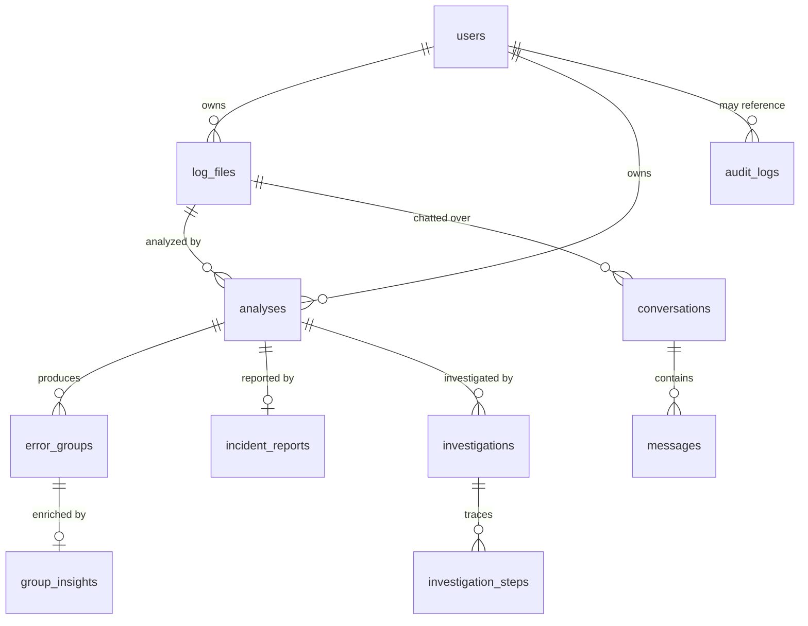

# 06 — Database Design

## Overview

PostgreSQL (async via SQLAlchemy 2.0 + asyncpg), schema managed by Alembic. Eleven tables across
six migrations (`backend/alembic/versions/001…006`). Tests run the same models on SQLite.

## Entity-relationship diagram

Source: [`diagrams/erd.mmd`](diagrams/erd.mmd). Full attribute list is in that file; summary:



## Tables

| Table | Migration | Purpose | Code |
|---|---|---|---|
| `users` | 001 | Accounts (email, bcrypt hash) | `models/user.py` |
| `audit_logs` | 001 | Append-only security events | `models/audit.py` |
| `log_files` | 002 | Uploaded/pasted logs (path, hash, format) | `models/log.py` |
| `analyses` | 002 | Analysis job + status machine + stats | `models/log.py` |
| `error_groups` | 002 | Deduplicated error groups (fingerprint, samples) | `models/log.py` |
| `group_insights` | 003 | AI insight per group (payload, tokens, cache flag) | `models/insight.py` |
| `conversations` | 004 | One per (user, log_file) | `models/chat.py` |
| `messages` | 004 | Chat turns + citations | `models/chat.py` |
| `incident_reports` | 005 | Generated markdown report (one per analysis) | `models/report.py` |
| `investigations` | 006 | Multi-agent run + conclusion | `models/investigation.py` |
| `investigation_steps` | 006 | Per-agent trace | `models/investigation.py` |

## Conventions

- **Primary keys:** string UUIDs (`models/base.py:UUIDPrimaryKey`) — no enumeration, safe to expose,
  SQLite-compatible.
- **Timestamps:** `created_at` / `updated_at` maintained by the DB (`server_default=func.now()`,
  `onupdate`) — correct even for out-of-app writes (`models/base.py:Timestamped`).
- **Cascade deletes:** child rows use `ondelete="CASCADE"` on their FKs.
- **Ownership:** every user-facing table carries `user_id`; queries filter by it (tenant isolation).

## Status enums

- `analyses.status`: `pending → running → completed | failed` (`models/log.py:AnalysisStatus`).
- `error_groups.severity`: `critical | high | medium | low` (`Severity`); set by a level heuristic
  in parsing and refined by AI ([07](07_AI_Architecture.md)).
- `investigations.status`: `running | completed | failed`.

## Migrations

```bash
docker compose exec api alembic upgrade head     # apply
alembic revision -m "add X"                       # new migration (then edit)
alembic downgrade -1                              # roll back one
```

Alembic uses an async engine and reads the URL from settings (`backend/alembic/env.py`) — never
hardcoded. **(Inference)** migrations are hand-written (not autogenerated) for review clarity.

## Indexing

Indexes exist on: `users.email` (unique), `log_files.user_id` & `content_hash`,
`analyses.user_id` & `log_file_id`, `error_groups.analysis_id` & `fingerprint`,
`group_insights.group_id` (unique) & `user_id` & `fingerprint`, conversation/message FKs,
investigation FKs. See each migration file.

## Security considerations

Only the bcrypt hash is stored (`users.hashed_password`); no plaintext. Audit log is append-only
(no update/delete methods on the repository). See [09 Security](09_Security.md).

## Performance & scaling considerations

- No `LogEntry` table by design — persisting 1M rows/file would bloat the DB; groups carry sample
  lines and the raw file stays on disk (see [ADR/(module-03)](modules/module-03-log-ingestion-and-parsing.md)).
- Fingerprint index powers the per-user insight cache.
- **(Inference)** connection pooling via `create_async_engine(pool_pre_ping=True)`; pool sizing is
  default and a tuning lever under load.

## Troubleshooting

Readiness failing on `database`? See [13 Troubleshooting](13_Troubleshooting.md).

## Interview notes

- **Why UUID PKs?** No enumeration attacks, safe to expose, client-generatable.
- **Why no LogEntry table?** Cost/scale — group + samples + on-disk raw file is enough for AI and
  RAG. Follow-up: "how does chat see full content then?" → RAG re-reads the file
  ([07](07_AI_Architecture.md)).
