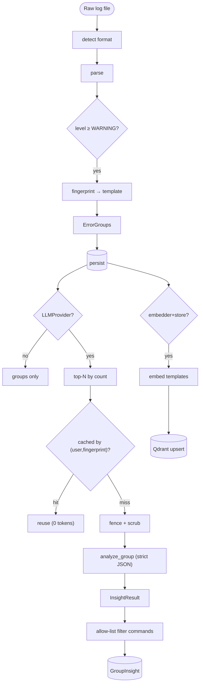
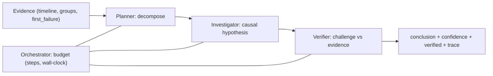

# 07 — AI Architecture

## Overview

The AI layer (`backend/app/ai/`) provides classification, root-cause analysis, explanation,
embeddings/similarity, RAG chat, remediation-command selection, and multi-agent investigation.
Everything sits behind interfaces so the entire system runs offline with deterministic fakes.

## AI pipeline diagram

Source: [`diagrams/ai_pipeline.mmd`](diagrams/ai_pipeline.mmd).

## Sub-systems

### 1. Providers — `ai/providers/`
`LLMProvider` protocol; `OpenAIProvider` (raw httpx, strict `json_schema` structured output + SSE
streaming); `MockLLMProvider` (deterministic keyword rules, powers tests and keyless demo).

### 2. Prompts — `ai/prompts/`
Versioned templates (`analysis-v1`, `chat-v1`) with few-shot examples, confidence guidance, and an
embedded injection rule tied to the fence markers.

### 3. Guards — `ai/guards/injection.py`
Three layers: **fence** log content in unique delimiters; **scrub** delimiter look-alikes and cap
length; **allow-list** filter on any model-suggested commands. See [09 Security](09_Security.md).

### 4. Insight analysis — `ai/pipelines/analyze.py`
Enriches top-N groups; fingerprint cache (postgres) avoids repeat LLM calls; per-group failures
degrade gracefully; AI refines severity over the parse-time heuristic.

### 5. Embeddings & vectors — `ai/embeddings/`, `ai/vectorstore/`
`EmbeddingProvider`: `HashingEmbedder` (dep-free bag-of-words, tests/dev) or
`SentenceTransformerEmbedder` (semantic, lazy torch import, prod). `VectorStore`:
`InMemoryVectorStore` or `QdrantVectorStore` (REST, **server-side `user_id` filter** = isolation).

### 6. RAG chat — `ai/rag/`
`chunking.py`: overlapping line windows with line-number provenance (for citations), stride widens
on huge files. `retriever.py`: **lexical-first** hybrid score (query-term coverage + cosine
tiebreaker) — because bag-of-words cosine drowns rare error terms in noisy chunks. Refusal below
`MIN_SCORE` happens **without an LLM call** (`ai/pipelines/chat.py`).

### 7. Remediation commands — `ai/commands/`
`catalog.py`: 13 read-only templates (kubernetes/linux/aws) with regex-validated params;
`render_command` substitutes into **our** template — injection is impossible by construction.
`selector.py`: deterministic error-type → template mapping (no extra LLM call).

### 8. Multi-agent investigation — `ai/agents/`
`Agent` protocol; Planner → Investigator → Verifier over a read-only `Evidence` toolbox;
`orchestrator.py` enforces `MAX_STEPS` and a wall-clock `DEADLINE_SECONDS`; the verifier refuses to
assert causation without a genuine first-failure **and** a cascade. Full step trace persisted.

## Configuration

`APP_OPENAI_API_KEY` (empty = AI off), `APP_OPENAI_MODEL_CHEAP/STRONG`,
`APP_AI_MAX_GROUPS_PER_ANALYSIS` (10), `APP_AI_TIMEOUT_SECONDS`, `APP_EMBEDDING_BACKEND`,
`APP_QDRANT_URL`. See [08 DevOps](08_DevOps_Deployment.md).

## Cost & safety controls

Group-before-LLM dedup, fingerprint insight cache, top-N cap, temperature 0.2, model tiering, and
deterministic (free) agents/selector/report. Commands are read-only and never executed.

## Security considerations

Prompt-injection defense (fence/scrub/allow-list), strict output schemas, per-user vector isolation,
graceful degradation on provider outage. Details: [09 Security](09_Security.md).

## Best practices / common pitfalls

- **Do** keep the fake providers in lockstep with the real ones (same interface).
- **Don't** let the model emit free-form shell — always render from the catalog.
- **Pitfall:** semantic cosine alone under-retrieves in noisy logs — hence lexical-first.

## Interview notes

- **How do you prevent hallucination in chat?** Code-level refusal below retrieval threshold (no
  LLM call) + mandatory line citations. Follow-up: "prompt vs code guardrail?" → code is the first
  line; prompt is the second.
- **When is multi-agent worth it?** Only multi-service cascades; single errors are cheaper in one
  shot (M4). Budgets + verifier + trace are what make it defensible, not a black box.
- See also [`docs/portfolio/interview-qa.md`](portfolio/interview-qa.md).
