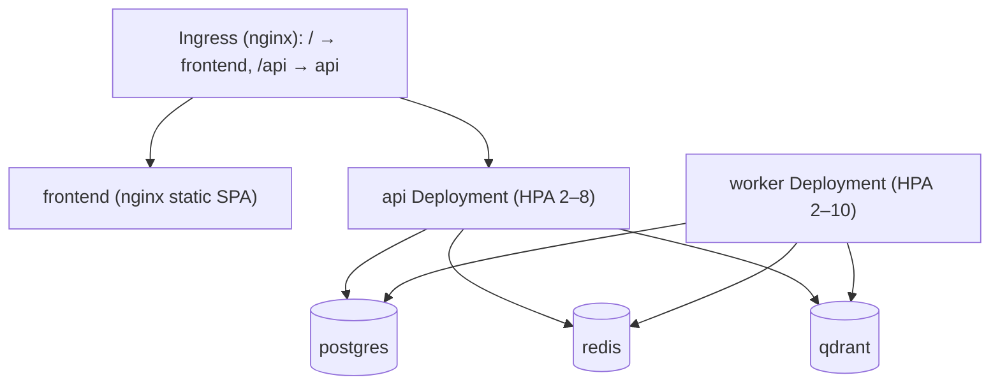
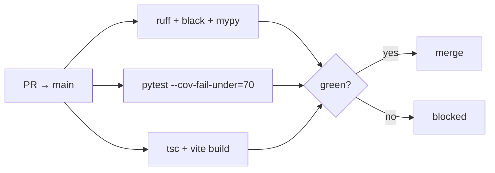

# 08 — DevOps & Deployment

## Overview

Containerized full stack. Local orchestration via Docker Compose; production via Kubernetes
manifests. CI on GitHub Actions. This document is the operational companion to
[`docs/guides/deployment-guide.md`](guides/deployment-guide.md).

## Deployment topology

Source: [`diagrams/deployment.mmd`](diagrams/deployment.mmd).



## Images

| Image | Dockerfile | Notes |
|---|---|---|
| `log-analyzer-api` | `infra/docker/api.Dockerfile` | multi-stage, non-root, HEALTHCHECK; also runs the worker (different command) |
| `log-analyzer-frontend` | `infra/docker/frontend.Dockerfile` | build SPA → serve via nginx (`frontend/nginx.conf`) |

## Local — Docker Compose

Services in `docker-compose.yml`: `api`, `worker`, `frontend`, `postgres`, `redis`, `qdrant`,
`prometheus`, `grafana`.

```bash
cp backend/.env.example backend/.env      # set POSTGRES_PASSWORD (+ APP_OPENAI_API_KEY optional)
docker compose up --build
docker compose exec api alembic upgrade head
```

| URL | Service |
|---|---|
| http://localhost:3000 | Frontend |
| http://localhost:8000/docs | API + Swagger |
| http://localhost:9090 | Prometheus |
| http://localhost:3001 | Grafana (admin / `GRAFANA_PASSWORD`) |

## Production — Kubernetes

Manifests in `infra/k8s/` (see `infra/k8s/README.md`): `namespace`, `configmap`, `secret.example`,
`data-stores`, `api`, `worker`, `frontend`, `ingress`, `hpa`. Apply order and commands are in
[`docs/guides/deployment-guide.md`](guides/deployment-guide.md).

Key properties:
- **Probes:** liveness `/api/v1/health`, readiness `/api/v1/health/ready` (separation is deliberate).
- **HPA:** api scales on CPU 70% (2–8); worker on CPU 75% (2–10). **(Inference/documented)** workers
  *should* scale on Celery queue depth via KEDA — CPU is the portable default; noted in `hpa.yaml`.
- **Config vs secrets:** non-secrets in ConfigMap; secrets (`APP_JWT_SECRET_KEY`,
  `APP_DATABASE_URL`, `APP_OPENAI_API_KEY`, `POSTGRES_PASSWORD`) in a Secret (`secret.yaml` is
  gitignored; only `secret.example.yaml` is committed).
- **Data stores** use `emptyDir` (demo) — swap for StatefulSet + PVC in real clusters.

## Configuration reference

All settings use prefix `APP_` (`backend/app/core/config.py`); documented in `backend/.env.example`.

| Variable | Default | Purpose |
|---|---|---|
| `APP_ENVIRONMENT` | development | dev/test/production (prod refuses dev JWT secret) |
| `APP_LOG_JSON` | true | JSON logs (prod) vs console (dev) |
| `APP_DATABASE_URL` | postgres asyncpg URL | DB connection |
| `APP_REDIS_URL` | redis://… | Celery broker (empty disables redis paths in tests) |
| `APP_QDRANT_URL` | (compose: http://qdrant:6333) | empty = similarity disabled |
| `APP_EMBEDDING_BACKEND` | hashing | `hashing` \| `sentence-transformers` |
| `APP_OPENAI_API_KEY` | "" | empty = AI disabled |
| `APP_JWT_SECRET_KEY` | dev default | **must** be set in production |
| `APP_ACCESS_TOKEN_EXPIRE_MINUTES` | 15 | access token TTL |
| `APP_REFRESH_TOKEN_EXPIRE_DAYS` | 7 | refresh token TTL |
| `APP_AI_MAX_GROUPS_PER_ANALYSIS` | 10 | AI cost cap |
| `APP_MAX_UPLOAD_BYTES` | 52428800 | 50MB upload cap |
| `APP_MAX_PASTE_BYTES` | 1048576 | 1MB paste cap |

## CI/CD

Source: [`diagrams/ci_cd.mmd`](diagrams/ci_cd.mmd) and `.github/workflows/ci.yml`.



Deployment is **manual** (build images → `docker compose`/`kubectl apply` → `alembic upgrade head`).
**(Inference)** a CD pipeline is a documented backlog item, not implemented.

## Monitoring

Prometheus scrapes `/metrics` (`infra/monitoring/prometheus.yml`); alerts in `alerts.yml`; Grafana
dashboard `grafana-dashboard.json`. See [10](10_Performance_and_Scaling.md) and
[12 Operations Runbook](12_Operations_Runbook.md).

## Security considerations

Non-root images, secrets separated from config, prod boot refuses the dev JWT secret, docs disabled
in prod. Production checklist: [`docs/guides/deployment-guide.md`](guides/deployment-guide.md) +
[09 Security](09_Security.md).

## Troubleshooting

Container/deploy issues → [13 Troubleshooting](13_Troubleshooting.md).

## Interview notes

- **One image, two processes — why?** Simpler builds/versioning; worker and api can scale
  independently. Follow-up: "how do workers autoscale correctly?" → queue depth (KEDA), not CPU.
- **Why disable `/docs` in prod?** Attack-surface reduction; schema still available internally.
