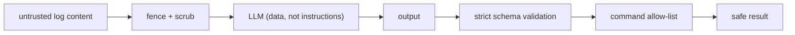

# 09 — Security

## Overview

Security is designed in at every layer: authentication, authorization/isolation, input validation,
prompt-injection defense, safe remediation, secrets management, and error hygiene.

## Authentication

- **JWT** access + refresh tokens (`backend/app/core/security.py`). Access ~15 min, refresh ~7 days.
- Claims: `sub`, `type` (`access`|`refresh` — a refresh token can never be used as access), `jti`
  (unique id, enables future revocation), `iat`, `exp`.
- **bcrypt** password hashing (unique salt per hash; constant-time verify). Only the hash is stored.
- **Refresh rotation:** every refresh issues a fresh pair. **(Inference/backlog)** a server-side
  `jti` denylist (Redis) to make rotation replay-proof is planned, not yet implemented.
- Production boot **refuses** the dev JWT secret (`config.py` validator).

## Authorization & tenant isolation

- Every user-owned query filters by `user_id`; another user's resource returns **404** (no
  existence leak) — e.g. `services/pipeline.py:get_analysis_for_user`, report/chat/investigation
  endpoints.
- Vector search applies the `user_id` filter **server-side** in Qdrant
  (`ai/vectorstore/qdrant.py`) — isolation is enforced in the store, not post-filtered.
- Tests assert cross-user 404 and cross-user empty similarity.

## Input validation

- Pydantic schemas validate all request bodies (e.g. password `min_length=10`).
- Upload streaming enforces size caps and deletes partial oversized files
  (`services/ingestion.py`); client filenames are never used as paths (own UUID names).

## Prompt-injection defense (log content is untrusted)

Three layers (`ai/guards/injection.py`), covered by adversarial tests:
1. **Fence** — log content wrapped in unique delimiters the system prompt declares inert data.
2. **Scrub** — delimiter look-alikes neutralized; length capped.
3. **Allow-list** — model-suggested commands filtered to a read-only catalog; and remediation
   commands are *rendered from templates* with regex-validated params, so destructive/chained
   commands cannot be produced.

## Rate limiting

Sliding-window limiter on auth and ingestion/chat/report/investigate endpoints
(`core/ratelimit.py`). **(Inference/backlog)** currently in-memory per-process; multi-replica
deployments need a Redis-backed limiter (noted in backlog and [10](10_Performance_and_Scaling.md)).

## Secrets management

- No secrets in code; all via `APP_*` env (`config.py`).
- `.env` and `infra/k8s/secret.yaml` are gitignored; only `.env.example` / `secret.example.yaml`
  are committed.
- `detect-private-key` pre-commit hook; CI could add secret scanning (backlog).

## Error hygiene

Domain exceptions → consistent JSON; unexpected exceptions log a traceback server-side and return a
generic 500 (no stack traces, SQL, or internals to clients) — `core/exceptions.py`.

## Auditing

Security-relevant events (register, login success/failure, token refresh) are written to an
append-only `audit_logs` table (`repositories/audit.py`).

## Safety boundary

Commands are **suggested, never executed**, and are read-only diagnostics only. This is a deliberate
product/security boundary (see [ADR/(module-08)](modules/module-08-remediation-and-reports.md)).

## Best practices / common pitfalls

- **Do** keep the in-memory limiter only for single-replica/dev; swap to Redis before scaling out.
- **Pitfall:** returning 403 instead of 404 leaks resource existence.
- **Pitfall:** trusting client filenames for storage paths (avoided here).

## Interview notes

- **Threat model for logs?** Attacker-controlled input → injection; handled by fence/scrub/allow-list
  + schema validation.
- **Why allow-list commands instead of sanitizing output?** Deny-by-default; a template that
  produces `rm -rf` simply doesn't exist. Follow-up: "how validated?" → regex per param before
  substitution (`ai/commands/catalog.py`).
- See [`docs/portfolio/interview-qa.md`](portfolio/interview-qa.md).
