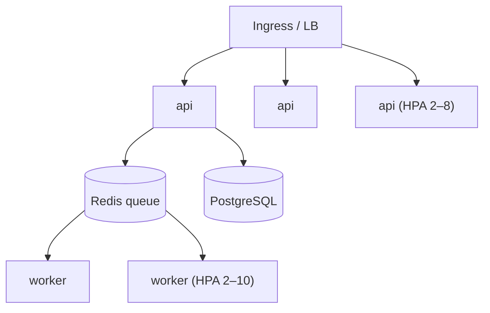

# 10 — Performance & Scaling

## Overview

Design targets (from requirements): API p95 < 300ms for non-AI endpoints; 100 concurrent users;
log files up to 50MB. AI work is decoupled from request latency by design.

## Levers implemented

| Lever | Mechanism | Code |
|---|---|---|
| Async everywhere | FastAPI + async SQLAlchemy + asyncpg | `core/db.py` |
| Off-request heavy work | `202 Accepted` + Celery | `api/v1/logs.py`, `workers/` |
| LLM cost/latency | group-before-LLM dedup + fingerprint insight cache + top-N cap | `services/pipeline.py`, `ai/pipelines/analyze.py` |
| Streaming | SSE for chat (time-to-first-token, not full-response latency) | `api/v1/chat.py` |
| Connection pooling | `create_async_engine(pool_pre_ping=True)` | `core/db.py` |
| Pagination | all list endpoints (`limit`/`offset`) | `api/v1/analyses.py` |
| Streamed uploads | 1MB chunks, never whole file in memory | `services/ingestion.py` |
| Bounded AI | top-N groups, agent step/time budgets | `config.py`, `ai/agents/orchestrator.py` |

## Scaling model



- **API:** stateless → scale horizontally (HPA on CPU).
- **Workers:** scale on load; CPU HPA today, **(documented)** queue-depth (KEDA) is the correct
  signal.
- **Data:** PostgreSQL is the primary vertical-scale/replica concern; Qdrant scales separately;
  Redis is lightweight.

## Metrics (RED method)

`/metrics` exposes per-route request counts, duration sum, and duration count
(`core/metrics.py`) — Rate, Errors, Duration. Paths are **templated** (`/analyses/{id}`) to avoid
high-cardinality metric explosion. Grafana dashboard: `infra/monitoring/grafana-dashboard.json`.

## Known bottlenecks & mitigations

| Bottleneck | Mitigation | Status |
|---|---|---|
| In-memory rate limiter not shared across replicas | Redis-backed limiter | Backlog |
| Ephemeral RAG chunk index rebuilt per chat request | persist chunks in Qdrant | Backlog |
| Worker CPU HPA lags real backlog | KEDA queue-depth scaling | Documented in `hpa.yaml` |
| sentence-transformers memory (~torch) | worker memory limits raised (1Gi) | Implemented |

See [`docs/planning/05-backlog.md`](planning/05-backlog.md).

## Load testing

Locust scenario models the real hot path (register → paste → poll → browse):
`backend/tests/performance/locustfile.py`.

```bash
pip install locust
locust -f backend/tests/performance/locustfile.py --host http://localhost:8000
```

## Capacity planning (Inference)

Rough guidance, not measured: API pods are CPU-light (100m request); worker pods are the heavy path
(AI + embeddings, 512Mi–1Gi). Cost scales primarily with OpenAI token usage, which the dedup + cache
levers directly reduce.

## Best practices / common pitfalls

- **Do** watch queue depth, not just CPU, for worker scaling.
- **Pitfall:** un-templated metric labels (UUIDs) cause cardinality blowups — avoided here.

## Interview notes

- **How do you keep the API fast under AI load?** AI is async behind `202`; the API never blocks on
  the model. Follow-up: "what if the queue backs up?" → autoscale workers on queue depth; users see
  `pending` longer but the API stays responsive.
- **Biggest cost lever?** Grouping before the LLM + per-fingerprint cache.
