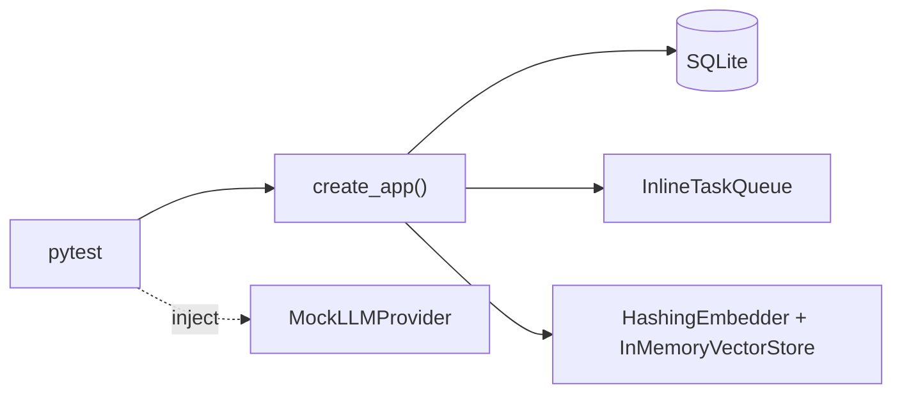

# 11 — Testing

## Overview

99 backend tests run **fully offline** in ~30s — no OpenAI calls, no Docker, no external services —
because every dependency has a deterministic fake. This is the project's core testing strategy.

## How offline testing works

`backend/tests/conftest.py` wires the fakes:
- **Database:** SQLite (aiosqlite), fresh file per test; tables via `create_all`.
- **Task queue:** `InlineTaskQueue` runs the real pipeline in-process (no Celery/Redis).
- **Embeddings/vectors:** `HashingEmbedder` + `InMemoryVectorStore` on `app.state`.
- **LLM:** tests inject `MockLLMProvider` where AI behavior is exercised.
- **Isolation:** per-test settings-cache clear, tmp upload dir, rate-limit reset.



## Test inventory (by area)

| Area | File | Covers |
|---|---|---|
| Config | `tests/unit/test_config.py` | defaults, env override, prod-secret validator |
| Health/metrics | `tests/unit/test_health.py`, `test_metrics.py` | probes, `/metrics`, path templating |
| Security | `tests/unit/test_security.py` | hashing, token expiry/tamper/type |
| Parsing | `tests/unit/test_parsing.py` | 4 parsers + detector |
| Fingerprint | `tests/unit/test_fingerprint.py` | stability, determinism |
| Injection guards | `tests/unit/test_injection_guards.py` | fence/scrub/allow-list, destructive-command rejection |
| Commands | `tests/unit/test_commands.py` | catalog read-only guard, param injection rejection |
| Embeddings | `tests/unit/test_embeddings.py` | normalization, store isolation/order |
| RAG | `tests/unit/test_rag.py` | chunk coverage/cap, retrieval hit/miss |
| Agents | `tests/unit/test_agents.py` | roles, budgets, verifier logic |
| Auth flow | `tests/integration/test_auth_flow.py` | register→login→me, refresh, 401/429 |
| Ingestion | `tests/integration/test_ingestion_flow.py` | paste/upload→poll→groups, isolation |
| AI flow | `tests/integration/test_ai_flow.py` | brief example contract, cache, degradation, injection |
| Similarity | `tests/integration/test_similarity_flow.py` | cross-analysis + cross-user |
| Chat | `tests/integration/test_chat_flow.py` | SSE grounding, refusal-without-call, 503, isolation |
| Reports | `tests/integration/test_report_flow.py` | generate/idempotent, download, commands |
| Investigation | `tests/integration/test_investigation_flow.py` | timeline order, verified conclusion, isolation |
| Performance | `tests/performance/locustfile.py` | load scenario (run separately) |

## Running

```bash
cd backend && pytest                 # all, ~30s
pytest --cov=app --cov-report=term-missing
pytest tests/unit/test_rag.py -q     # one file
```

CI enforces `--cov-fail-under=70` plus ruff/black/mypy, and a frontend typecheck+build job
(`.github/workflows/ci.yml`).

## Real bugs caught by tests

- Commit-before-enqueue race (worker found no rows).
- Chunker variable shadowing + tail-coverage gap on huge files.
- Retrieval under-recall (bag-of-words cosine drowned rare terms) → lexical-first fix.

## Best practices / common pitfalls

- **Do** assert the *contract* (status, fields), not implementation details.
- **Do** keep fakes in lockstep with real impls (same interface).
- **Pitfall:** SQLite ≠ PostgreSQL for some behaviors — Postgres-specific paths need a real-DB
  integration job (backlog).

## Interview notes

- **How do you test an AI system deterministically?** Interfaces + fakes; the mock exercises the
  *plumbing*, real quality depends on the live model. Follow-up: "how do you catch prompt
  regressions?" → an eval harness on seeded incidents (backlog, [16](16_Interview_Guide.md)).
