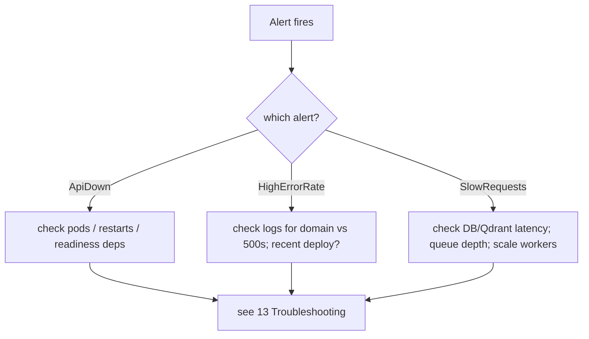

# 12 — Operations Runbook

## Overview

Day-2 operations for on-call engineers: health, deploy, migrations, scaling, backups, and incident
response. Pairs with [13 Troubleshooting](13_Troubleshooting.md).

## Health & readiness

| Check | Endpoint | Meaning | On failure |
|---|---|---|---|
| Liveness | `GET /api/v1/health` | process up | K8s restarts the pod |
| Readiness | `GET /api/v1/health/ready` | DB + vector store reachable | K8s stops routing (no restart) |
| Metrics | `GET /metrics` | Prometheus scrape | investigate scrape config |

Readiness body: `{"status":"ready|degraded","checks":{"app":true,"database":true,"vector_store":true}}`.

## Routine operations

**Deploy (compose):** `docker compose up --build -d` then `docker compose exec api alembic upgrade head`.
**Deploy (k8s):** build+load images → `kubectl apply -f infra/k8s/…` → `kubectl -n log-analyzer exec deploy/api -- alembic upgrade head`.
**Rollback:** redeploy previous image tag; DB `alembic downgrade -1` only if the release added a
migration (verify it's reversible first).

## Scaling

- API/worker autoscale via HPA. Manual: `kubectl -n log-analyzer scale deploy/worker --replicas=N`.
- If analyses back up, scale **workers** first (they do the heavy AI/embedding work).

## Monitoring & alerts

Prometheus rules (`infra/monitoring/alerts.yml`):
- `HighErrorRate` — 5xx ratio > 5% for 5m (critical)
- `SlowRequests` — avg latency > 300ms for 10m (warning)
- `ApiDown` — target down 1m (critical)

Grafana dashboard shows request rate by path, 5xx ratio, latency, totals.

## Backups (Inference / production checklist)

Not automated in-repo. For production: managed PostgreSQL with PITR backups; Qdrant snapshots; the
uploads volume is regenerable-from-source but back it up if raw logs must be retained.

## Common operational tasks

| Task | Command |
|---|---|
| Tail worker logs | `docker compose logs -f worker` / `kubectl logs -f deploy/worker -n log-analyzer` |
| Inspect queue | check Redis list length (broker); (Inference) add Flower for Celery visibility |
| Re-run a failed analysis | re-upload the file (analyses are immutable; idempotent by content hash) |
| Regenerate a report | `POST /analyses/{id}/report` (idempotent) |

## Incident response quick path

## Security operations

- Rotate `APP_JWT_SECRET_KEY` if compromise suspected (invalidates all tokens).
- If a secret was committed: rotate immediately, purge history, add CI secret scanning.

## Best practices / common pitfalls

- **Do** run `alembic upgrade head` on every deploy that ships a migration.
- **Pitfall:** scaling API instead of workers when the *queue* is the bottleneck.

## Interview notes

- **What's your rollback story?** Redeploy previous image; reverse the migration only if the release
  added one and it's reversible. Follow-up: "zero-downtime migrations?" → expand/contract pattern
  (backlog).
