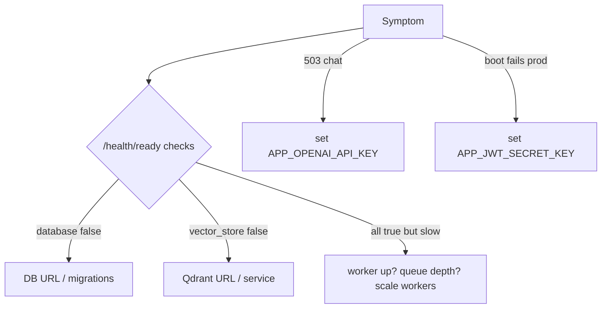

# 13 — Troubleshooting

## Overview

Symptom → likely cause → fix. Ordered by how often each tends to occur during setup and operation.

## Analysis stuck in `pending` / `running`

**Cause:** the Celery worker isn't consuming (not running, wrong broker URL, or crashed).
**Fix:** confirm the `worker` service is up (`docker compose ps` / `kubectl get pods`); check
`APP_REDIS_URL` matches on api and worker; tail worker logs. In tests this can't happen (inline
queue runs synchronously). Related design note: commit-before-enqueue (`api/v1/logs.py`).

## Chat returns 503 `ai_unavailable`

**Cause:** no LLM provider configured. **Fix:** set `APP_OPENAI_API_KEY`. Without it, analysis still
works (groups only); only chat and AI insights are disabled — by design.

## Readiness `degraded` — `database: false`

**Cause:** DB unreachable or migrations not applied. **Fix:** verify `APP_DATABASE_URL`, that
`postgres` is healthy, and run `alembic upgrade head`.

## Readiness `degraded` — `vector_store: false`

**Cause:** `APP_QDRANT_URL` set but Qdrant unreachable. **Fix:** check the `qdrant` service; or unset
`APP_QDRANT_URL` to disable similarity (readiness will omit the check).

## App refuses to boot in production

**Cause:** `APP_ENVIRONMENT=production` with the default dev JWT secret. **Fix:** set a real
`APP_JWT_SECRET_KEY` (the config validator enforces this — a feature, not a bug).

## Upload rejected `413 file_too_large`

**Cause:** file > 50MB (`APP_MAX_UPLOAD_BYTES`) or paste > 1MB. **Fix:** split the log or raise the
cap; also ensure ingress `proxy-body-size` ≥ cap (set to 60m in `ingress.yaml`/`nginx.conf`).

## 401 loops on the frontend

**Cause:** refresh token missing/expired. **Fix:** the client auto-refreshes once then redirects to
login (`frontend/src/api/client.ts`); if it loops, the refresh token is invalid — re-login.

## `429 rate_limited`

**Cause:** endpoint rate limit hit (e.g. login 10/60s). **Fix:** back off. Note the limiter is
**per-process** today; behind multiple replicas limits are effectively multiplied (backlog: Redis
limiter).

## Similar incidents always empty

**Cause:** similarity disabled (`APP_QDRANT_URL` empty) or `hashing` backend with too little
overlap. **Fix:** configure Qdrant; use `sentence-transformers` for semantic matching.

## Frontend can't reach the API

**Cause:** origin/proxy misconfig. **Fix:** dev uses Vite proxy (`vite.config.ts`); prod uses nginx
reverse-proxy (`frontend/nginx.conf`) — both make `/api` same-origin, so there should be no CORS.

## Diagnostic flow

## Escalation

Persisting issues → check `docs/planning/04-risk-register.md` for known risks and
[12 Operations Runbook](12_Operations_Runbook.md) for deploy/rollback.

## Interview notes

- **A user says "analysis never finishes" — how do you debug?** Check worker liveness → broker URL
  → worker logs → DB writes; confirm the job was enqueued after commit.
