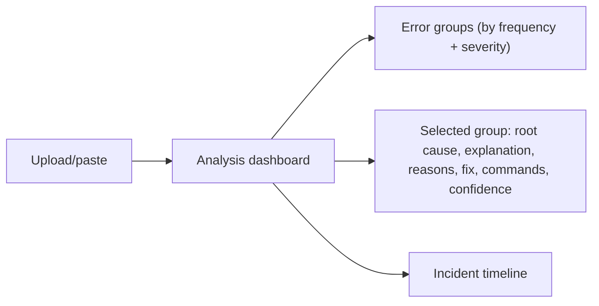

# 15 — User Guide

## Overview

How an end user (SRE / DevOps / developer) uses the platform. This mirrors and expands
[`docs/guides/user-guide.md`](guides/user-guide.md).

## Getting in

1. Open the app (http://localhost:3000 locally, or your deployed URL).
2. **Register** with an email and a password of at least 10 characters, then you're signed in.

## Analyze a log

1. On the home page, **drag-drop** a `.log` / `.txt` / `.json` file (up to 50MB) or **paste** log
   lines. Format is detected automatically.
2. You're taken to the analysis page, which polls until processing completes.

## Read the results

- **Left rail:** deduplicated error groups, most frequent first, with severity badges.
- **Detail panel:** root cause, plain-language explanation, likely reasons, suggested fix,
  read-only diagnostic commands, and a confidence score. A "cached" tag means the insight was
  reused from an identical past error (no cost).

## Chat with your log

Click **Chat with this log** and ask questions like *"what happened between 10:12 and 10:15?"* or
*"which error came first?"*. Answers **cite the exact line ranges** they're based on, and will say
*"I don't see that in this log"* rather than guess.

## Timeline & investigation

- **Timeline** orders the errors causally and highlights the **first failure**.
- **Investigate** runs a multi-agent analysis that proposes and *verifies* a causal chain (e.g.
  "redis exhaustion triggered the DB timeouts"), with an inspectable step trace.

## Incident report

Click **Incident report** to generate a postmortem-ready markdown document (summary → impact →
findings → prevention), downloadable via **Download .md**.

## History & similar incidents

The **History** tab lists past analyses. On an analysis, **similar past incidents** link across your
history so you can see "have we seen this before?".

## Notes

- **AI features need an OpenAI key** configured by your administrator. Without one, parsing,
  grouping, timelines, and reports still work; AI insights and chat are disabled.
- **Commands are read-only diagnostics only** — the tool never suggests destructive commands and
  never runs anything for you.
- Your logs and analyses are **private to your account**.

## Troubleshooting (user-facing)

- "Chat says it can't help" → likely no OpenAI key configured (ask your admin).
- "Upload rejected" → file over 50MB; split it.
- See [13 Troubleshooting](13_Troubleshooting.md) for more.

## Interview notes

- **What's the user's aha-moment?** Thousands of lines collapse into a handful of grouped,
  explained problems with next-step commands — diagnosis in seconds.
