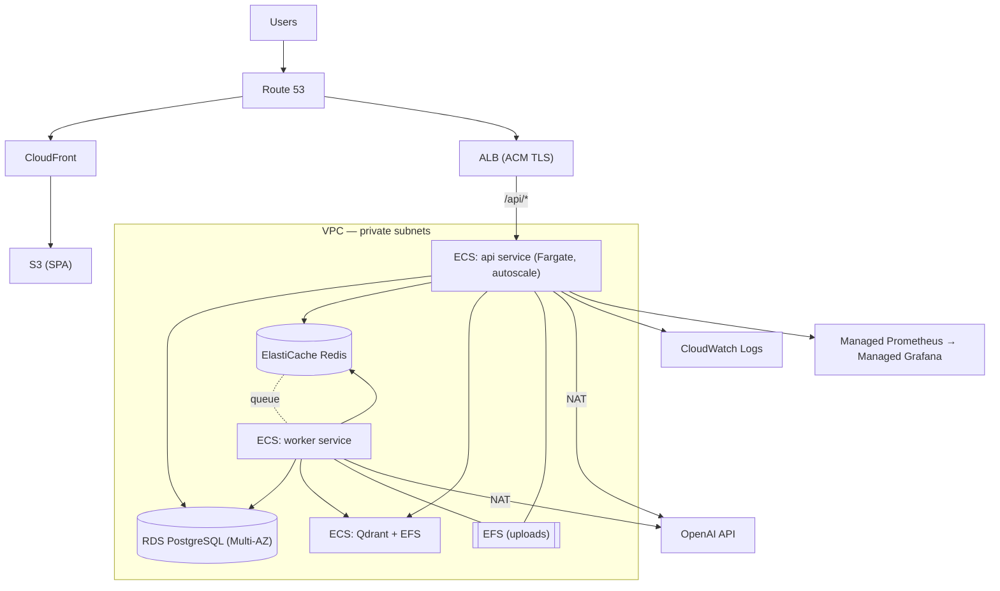

# AWS Deployment — Services & Configuration

How to run AI Log Analyzer on AWS. Mappings are derived from the actual components
(`docker-compose.yml`, `infra/k8s/`, `backend/app/core/config.py`). Anything not implemented in the
repo is marked **(Inference / requires setup)**.

> TL;DR recommended stack: **ECS Fargate** (api + worker + Qdrant) · **RDS PostgreSQL** ·
> **ElastiCache Redis** · **EFS** (shared uploads) · **S3 + CloudFront** (frontend) ·
> **ALB** · **Secrets Manager** · **ECR** · **CloudWatch** (+ optional AMP/AMG).

## Component → AWS service mapping

| Project component | AWS service | Notes |
|---|---|---|
| API (FastAPI, `api` container) | **ECS Fargate service** behind **ALB** | stateless; target-tracking autoscaling on CPU |
| Worker (Celery, `worker` container) | **ECS Fargate service** (no ALB) | scale on queue depth (see below) |
| Frontend (nginx static SPA) | **S3** (static site) + **CloudFront** (CDN, TLS) | or a small Fargate nginx task |
| PostgreSQL | **Amazon RDS for PostgreSQL** (or Aurora PostgreSQL) | Multi-AZ for prod; automated backups |
| Redis (Celery broker) | **Amazon ElastiCache for Redis** | single node dev; replication group prod |
| Qdrant (vectors) | **Self-hosted Qdrant on ECS Fargate** + **EFS** | no managed equivalent; alt: OpenSearch k-NN (**Inference**, needs code change) |
| Uploaded logs (`APP_UPLOAD_DIR`) | **Amazon EFS** mounted on api + worker | both processes share this path — EFS is the direct analog of the compose `uploads` volume |
| Container images | **Amazon ECR** | one repo for api image, one for frontend |
| Secrets (`APP_JWT_SECRET_KEY`, DB URL, OpenAI key) | **AWS Secrets Manager** (or SSM Parameter Store SecureString) | injected as task secrets |
| Non-secret config | **SSM Parameter Store** or task env | mirrors the ConfigMap in `infra/k8s/configmap.yaml` |
| Ingress / routing | **Application Load Balancer** | path rules: `/api/*` → api, `/*` → frontend/S3 |
| DNS + TLS | **Route 53** + **ACM** | HTTPS on ALB/CloudFront |
| Structured logs (structlog JSON) | **CloudWatch Logs** (awslogs log driver) | JSON logs are already query-friendly |
| Metrics (`/metrics`, Prometheus) | **Amazon Managed Prometheus (AMP)** + **Amazon Managed Grafana (AMG)** | or CloudWatch Container Insights |
| OpenAI API | external — egress via **NAT Gateway** | tasks in private subnets need NAT for outbound HTTPS |
| Networking | **VPC** (2+ AZs), public+private subnets, **Security Groups**, **NAT Gateway** | data stores in private subnets only |

## Reference architecture (ECS Fargate)

## Environment variable → AWS wiring

App settings use the `APP_` prefix (`backend/app/core/config.py`). Set these on both the `api` and
`worker` task definitions.

| Variable | Source on AWS | Example |
|---|---|---|
| `APP_ENVIRONMENT` | task env | `production` |
| `APP_JWT_SECRET_KEY` | **Secrets Manager** | (random 64-char) — prod boot refuses the dev default |
| `APP_DATABASE_URL` | Secrets Manager | `postgresql+asyncpg://user:pass@<rds-endpoint>:5432/loganalyzer` |
| `APP_REDIS_URL` | SSM / env | `redis://<elasticache-endpoint>:6379/0` |
| `APP_QDRANT_URL` | SSM / env | `http://<qdrant-service-dns>:6333` |
| `APP_OPENAI_API_KEY` | Secrets Manager | `sk-...` (empty disables AI) |
| `APP_UPLOAD_DIR` | task env | `/srv/uploads` (EFS mount point) |
| `APP_EMBEDDING_BACKEND` | SSM / env | `sentence-transformers` (prod) |
| `APP_LOG_JSON` | env | `true` |
| `POSTGRES_PASSWORD` | Secrets Manager | used by RDS provisioning |

## Sizing (starting point — Inference, tune under load)

| Task | vCPU / memory | Why |
|---|---|---|
| api | 0.5 vCPU / 1 GB | CPU-light, async I/O |
| worker | 1 vCPU / 2 GB | AI + `sentence-transformers` (torch) is the heavy path |
| Qdrant | 0.5 vCPU / 1 GB + EFS | vector store |
| RDS | db.t3.small (dev) → db.r6g (prod) | primary scaling concern |
| ElastiCache | cache.t3.micro (dev) | broker is lightweight |

## Autoscaling

- **api:** ECS Service Auto Scaling, target-tracking on CPU ~70% (mirrors `infra/k8s/hpa.yaml`).
- **worker:** the correct signal is **Celery queue depth**, not CPU. On ECS, publish the Redis list
  length as a **CloudWatch custom metric** and scale on it; on EKS use **KEDA** with the Redis
  scaler. **(Inference — not built in the repo; documented in `hpa.yaml` and the backlog.)**

## Two required design considerations (read before deploying)

1. **Shared uploads storage.** The API writes the raw log to `APP_UPLOAD_DIR` and the worker
   (and RAG chat) read it back. On AWS the api and worker are separate tasks, so this path **must**
   be shared — use **EFS** mounted on both. Alternatively, refactor `services/ingestion.py` +
   `services/pipeline.py` + `ai/rag` to use **S3** (cleaner, but a code change).
2. **Qdrant is self-managed.** There is no managed Qdrant on AWS. Run it as an ECS/EKS task with an
   EFS or EBS volume, or (bigger change) swap the `VectorStore` interface implementation for
   **Amazon OpenSearch Service k-NN** or **pgvector on RDS** — both are drop-in behind
   `backend/app/ai/vectorstore/base.py`.

## Alternative stacks

| Goal | Stack |
|---|---|
| **Lowest ops / quickest** | **AWS App Runner** for api + worker (from ECR) · RDS · ElastiCache · S3+CloudFront frontend. Fewest moving parts; less control over networking/autoscaling. |
| **1:1 with existing manifests** | **Amazon EKS** — apply `infra/k8s/` almost as-is; add EFS CSI driver, AWS Load Balancer Controller (ALB Ingress), External Secrets, and KEDA for worker scaling. |
| **Recommended balance** | **ECS Fargate** (this document). |

## Migrations & deploy

Run Alembic once per release as a **one-off ECS task** using the api image:
`alembic upgrade head`. Wire the existing GitHub Actions CI to `docker build` → `ecr push` →
`aws ecs update-service --force-new-deployment` (**Inference — CD pipeline not in the repo**; today
deployment is manual, see `docs/guides/deployment-guide.md`).

## Security on AWS

- Data stores (RDS, ElastiCache, Qdrant) in **private subnets**; Security Groups allow only the
  api/worker SGs.
- Secrets in **Secrets Manager** (rotation for RDS); never in task env plaintext.
- TLS via **ACM** on ALB + CloudFront.
- IAM task roles scoped to only the needed secrets/S3/EFS.
- See [`docs/09_Security.md`](../09_Security.md) for the application-level controls (JWT,
  injection defense, isolation) that are AWS-agnostic.

## Cost drivers (Inference)

Largest to smallest, typically: **OpenAI tokens** (mitigated by dedup + insight cache) → **RDS** →
**NAT Gateway** data processing → **Fargate** tasks → ElastiCache/EFS/CloudWatch. A dev environment
on the smallest instances is inexpensive; the `MockLLMProvider` lets you run demos with zero OpenAI
cost.

## Cross-references

- Kubernetes path: [`infra/k8s/`](../../infra/k8s/) and [`docs/08_DevOps_Deployment.md`](../08_DevOps_Deployment.md)
- Local/compose: [`docs/guides/deployment-guide.md`](deployment-guide.md)
- Scaling rationale: [`docs/10_Performance_and_Scaling.md`](../10_Performance_and_Scaling.md)
