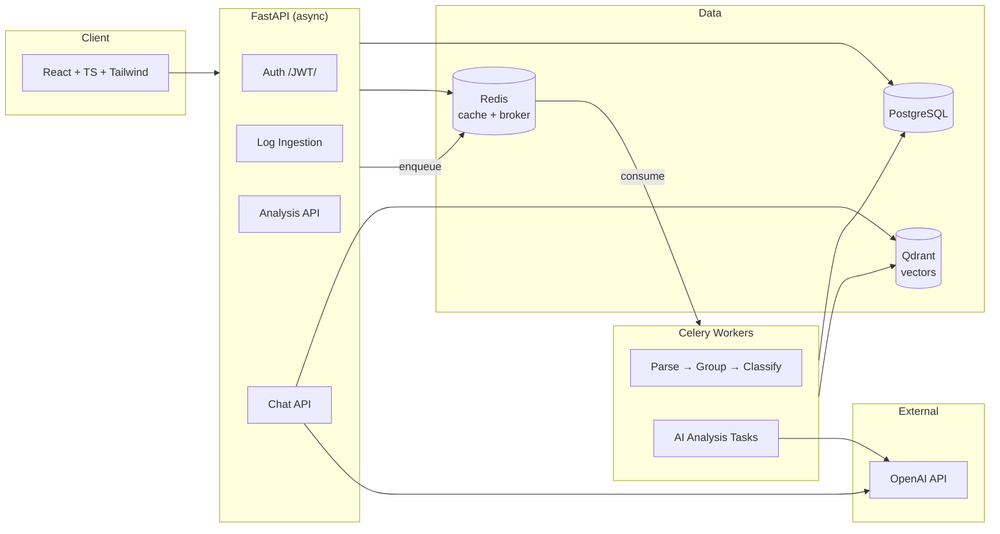
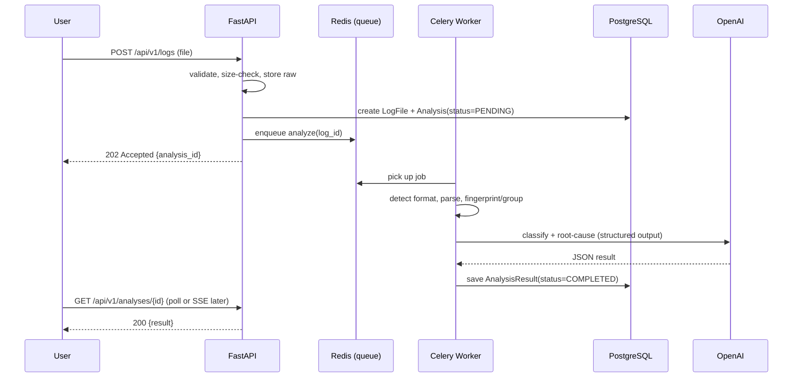

# Architecture — AI Log Analyzer

> Module 0 deliverable. Decisions here are binding until revisited with a written ADR.

## 1. Architectural Style: Modular Monolith

**Decision:** One FastAPI application with strict internal module boundaries (clean architecture
layers), deployed as a single container — *not* microservices.

**Why:**
- Microservices solve *organizational* scaling (many teams), which we don't have. They add
  network failure modes, distributed tracing, and deployment complexity with zero benefit at this size.
- A modular monolith with clean boundaries can be split later — the module seams *are* the
  future service boundaries. This is the industry-standard advice (Shopify, Basecamp, most startups).
- Interview-relevant tradeoff: "monolith vs microservices" — the senior answer is almost always
  "modular monolith first."

**What stays separate:** the Celery worker (same codebase, different process) — because AI
analysis is slow (seconds–minutes) and must not block API request threads.

## 2. System Overview



## 3. Request Flow: Upload → Analysis



**Key decision — async job, not sync request:** AI analysis can take 10–60s. Holding an HTTP
request open that long fails at every level (timeouts, retries duplicating cost, thread
starvation). `202 Accepted` + status polling is the standard pattern; we can add SSE/WebSocket
push later without changing the model.

## 4. Clean Architecture Layers

```
Request → API (routers) → Services (use-cases) → Repositories (data) → DB
                              ↓
                        AI module (LLM clients, prompts, pipelines)
```

| Layer | Knows about | Never knows about |
|---|---|---|
| `api/` (routers, deps) | schemas, services | SQLAlchemy models, LLM SDKs |
| `services/` | repositories, AI interfaces, domain rules | HTTP, FastAPI request objects |
| `repositories/` | SQLAlchemy models, sessions | business rules, HTTP |
| `ai/` | LLM provider interface, prompts, parsers | HTTP, DB sessions |
| `models/` (ORM) | the database schema | everything else |
| `schemas/` (Pydantic) | wire formats | ORM internals |

**Dependency rule:** dependencies point inward. Routers depend on services; services depend on
abstractions (repository + LLM provider interfaces). This is what makes AI mockable in tests.

## 5. Folder Structure

```
ai-log-analyzer/
├── backend/
│   ├── app/
│   │   ├── main.py                 # app factory, lifespan
│   │   ├── api/
│   │   │   ├── deps.py             # DI wiring (get_db, get_current_user, …)
│   │   │   └── v1/                 # versioned routers: auth, logs, analyses, chat
│   │   ├── core/                   # config, security, logging, exceptions
│   │   ├── models/                 # SQLAlchemy ORM
│   │   ├── schemas/                # Pydantic request/response
│   │   ├── repositories/           # data access (repository pattern)
│   │   ├── services/               # business logic / use-cases
│   │   ├── ai/
│   │   │   ├── providers/          # LLMProvider interface + OpenAI impl
│   │   │   ├── prompts/            # versioned prompt templates
│   │   │   ├── pipelines/          # classification, root-cause, RAG …
│   │   │   └── guards/             # prompt-injection defenses, output validation
│   │   ├── parsing/                # format detection, parsers, fingerprinting
│   │   └── workers/                # celery app + tasks
│   ├── tests/                      # unit/ + integration/ mirror app/
│   ├── alembic/                    # migrations
│   └── pyproject.toml
├── frontend/                       # React + TS (added at Milestone 6)
├── infra/
│   ├── docker/                     # Dockerfiles
│   ├── k8s/                        # manifests
│   └── monitoring/                 # prometheus, grafana
├── docs/
└── docker-compose.yml
```

## 6. Key Technology Decisions & Tradeoffs

| Decision | Choice | Rejected | Why |
|---|---|---|---|
| LLM access | Provider **interface** with OpenAI impl | Direct SDK calls everywhere | Testable (mock provider), swappable, single place for retries/budgets |
| LangChain | **No** (for core) | LangChain everywhere | Thin, debuggable code beats framework magic for a portfolio project; we may use it narrowly for RAG if it earns its keep |
| Structured output | OpenAI structured outputs → Pydantic | Free-text parsing | Deterministic schemas; parse failures become typed errors |
| Vector store | **Qdrant** (container) | FAISS in-process | FAISS = library, no persistence/filtering ops story; Qdrant runs in compose/K8s like a real deployment, supports payload filtering (per-user isolation) |
| Background jobs | **Celery + Redis** | FastAPI BackgroundTasks | BackgroundTasks dies with the process, no retries/visibility; Celery gives retries, monitoring (Flower), horizontal scale. Cost: extra moving part — accepted, it's core to the product |
| ORM | SQLAlchemy 2.0 **async** | Django ORM, raw SQL | Industry standard with FastAPI; async matches the stack |
| Auth | Self-managed JWT (access+refresh) | Auth0/Clerk | Building it is the point (portfolio); production note documented |
| DB | PostgreSQL | Mongo | Relational data (users→logs→analyses), JSONB where flexible |

## 7. Cross-Cutting Concerns (designed now, built incrementally)

- **Config:** pydantic-settings, 12-factor env vars, no secrets in code — ever.
- **Errors:** domain exceptions → exception handlers → RFC-7807-style JSON problem responses.
- **Logging:** structured JSON logs (we're a log tool — our own logs must be parseable).
- **Security:** JWT, per-route rate limits (Redis), strict upload validation, prompt-injection
  guards (log content fenced as data, output schema validation, command suggestions from
  allow-listed templates only).
- **Cost control:** model tiering (cheap model for classification, strong model for root cause),
  Redis caching on content-hash, per-user token budgets.

## 8. Future-Proofing Hooks (not built now)

- Log source abstraction (`LogSource` interface) so K8s/Docker/stream sources plug in later.
- SSE endpoint reserved for streaming analysis progress.
- Module seams allow extracting `workers/` + `ai/` into a separate service if load demands.
