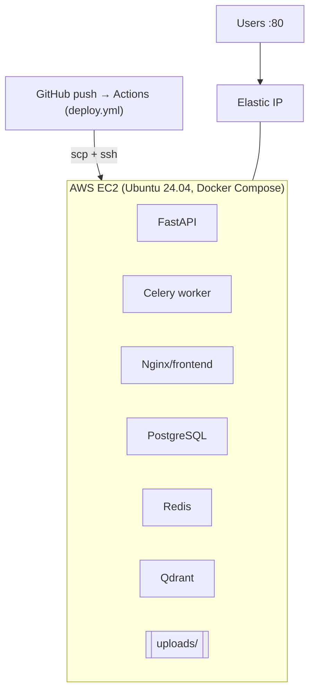

# POC on AWS — Terraform (single EC2 + Docker Compose)

Provisions a self-contained POC: one VPC + public subnet, a security group (22/80/443 only), an
Ubuntu 24.04 EC2 (`t3.large`, 40 GB gp3, Docker preinstalled), a stable Elastic IP, and an optional
S3 static-site bucket for the frontend. Deployment of the app itself is handled by the
`Deploy to EC2 (POC)` GitHub Actions workflow.



## Prerequisites

- Terraform ≥ 1.5, AWS CLI configured (`aws configure`) with permission to create VPC/EC2/S3/EIP.
- An SSH key pair. Create one if needed: `ssh-keygen -t ed25519 -f ~/.ssh/aila_poc`.

## 1. Provision infrastructure

```bash
cd infra/terraform/poc
cp terraform.tfvars.example terraform.tfvars
# edit terraform.tfvars: paste `cat ~/.ssh/aila_poc.pub` into ssh_public_key,
# and set ssh_allowed_cidr to YOUR.IP/32
terraform init
terraform apply
```

Note the outputs, especially `public_ip` and `app_url`.

## 2. Configure GitHub secrets

Repo → **Settings → Secrets and variables → Actions** → add:

| Secret | Value |
|---|---|
| `EC2_HOST` | Terraform output `public_ip` |
| `EC2_USERNAME` | `ubuntu` |
| `EC2_SSH_KEY` | contents of the **private** key (`cat ~/.ssh/aila_poc`) |
| `OPENAI_API_KEY` | your key (optional — omit to run without AI) |
| `JWT_SECRET` | a long random string |

## 3. Deploy

Push to `main` (or run the workflow manually). `.github/workflows/deploy.yml` copies the repo to the
instance, writes `backend/.env` from the secrets, runs `docker compose up -d --build`, and applies
migrations. Then open `http://<public_ip>`.

## Important: serve the frontend on port 80

The committed `docker-compose.yml` maps the frontend container to host port **3000**. For the POC to
answer on **:80**, either:
- change the frontend service port to `"80:80"` in `docker-compose.yml`, **or**
- add a `docker-compose.override.yml` on the instance with that mapping, **or**
- access the app at `http://<public_ip>:3000` and open port 3000 in the security group.

(Compose keeps postgres/redis/qdrant internal to the Docker network — they are **not** exposed
publicly, matching the security group.)

## Cost & teardown

`t3.large` + EIP + 40 GB gp3 is a modest hourly cost; the biggest variable is OpenAI usage (run with
the mock provider — omit `OPENAI_API_KEY` — for a zero-token demo). Tear everything down with:

```bash
terraform destroy
```

## Phase 4 — S3 frontend (optional)

Set `enable_s3_frontend = true`, `terraform apply`, then build and sync the SPA:

```bash
cd ../../../frontend && npm ci && npm run build
aws s3 sync dist/ "s3://$(terraform -chdir=../infra/terraform/poc output -raw frontend_bucket)/" --delete
```

Point the SPA's API base at `http://<ec2_public_ip>/api` (and open CORS or keep same-origin via a
reverse proxy). For real use, front the bucket with CloudFront + OAC.

## Roadmap (from the plan)

1. **Phase 1** — this Terraform (EC2 + Docker + Compose). ✅
2. **Phase 2** — GitHub Actions SSH deploy. ✅ (`deploy.yml`)
3. **Phase 3** — push images to **ECR**, `docker compose pull` on EC2 (faster, no build on host).
4. **Phase 4** — host the frontend on **S3/CloudFront**, backend on EC2.

See [`docs/guides/aws-deployment.md`](../../../docs/guides/aws-deployment.md) for the production
(ECS/EKS) target.
